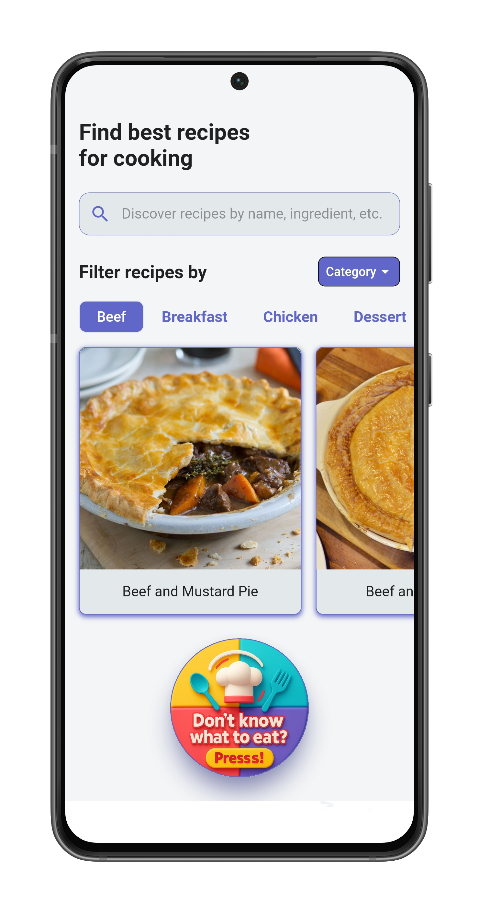
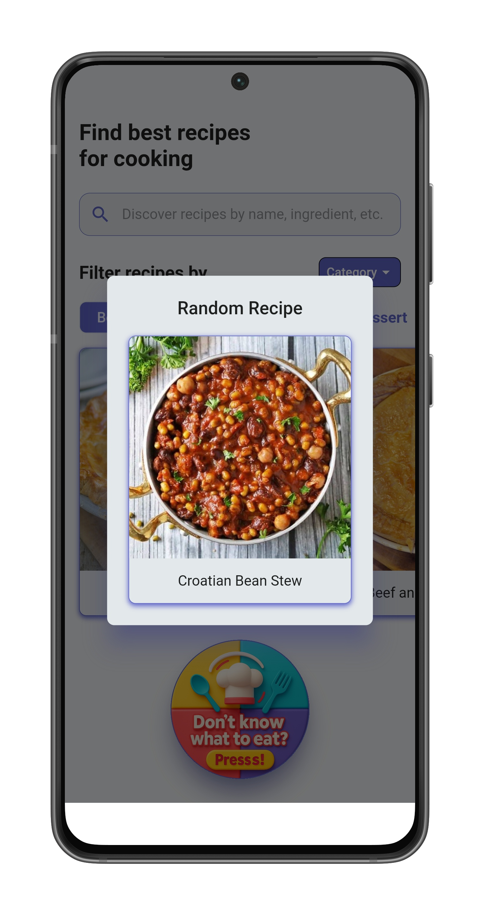
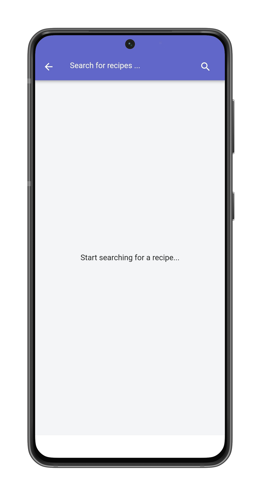
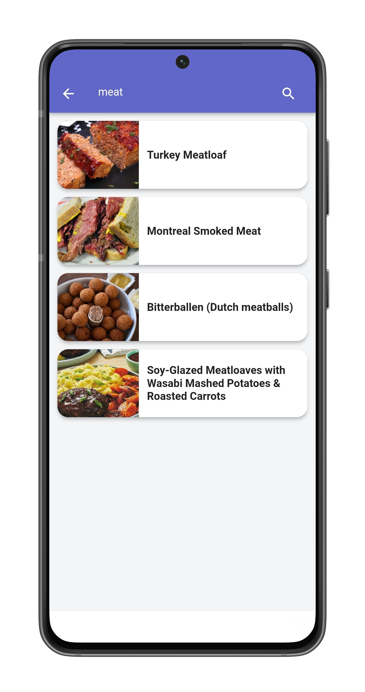
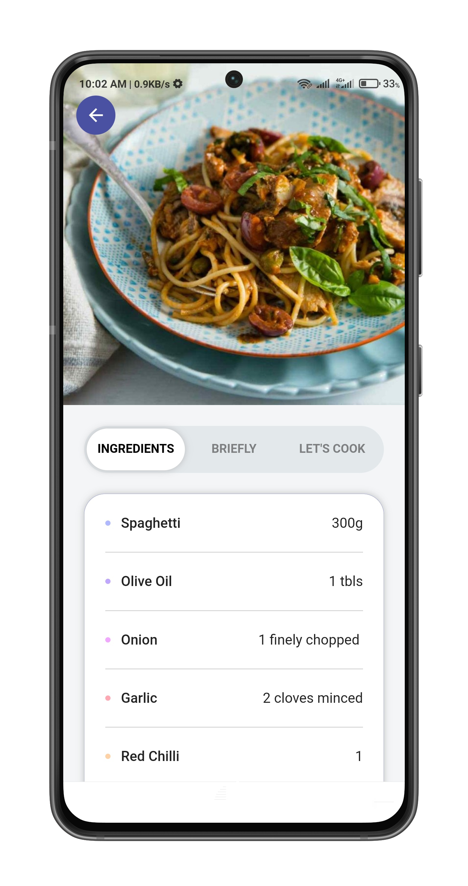
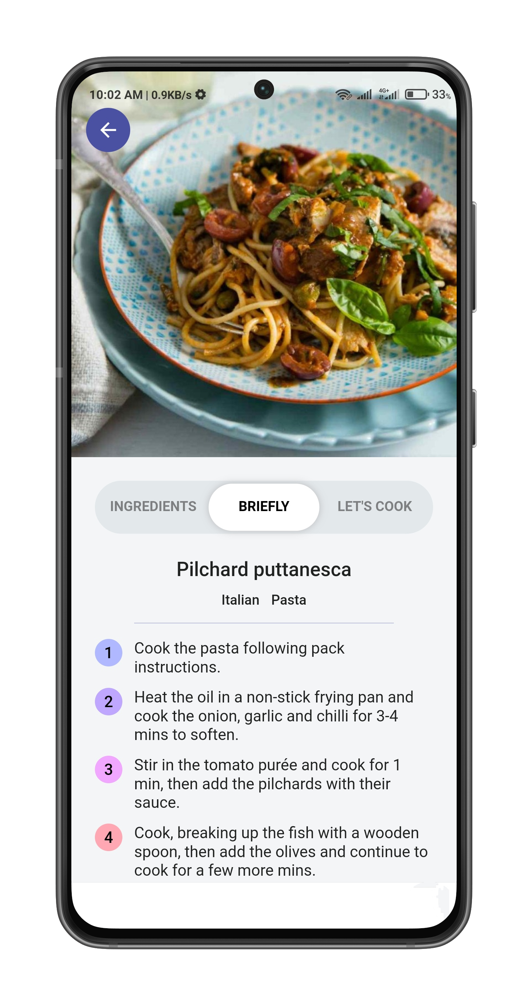
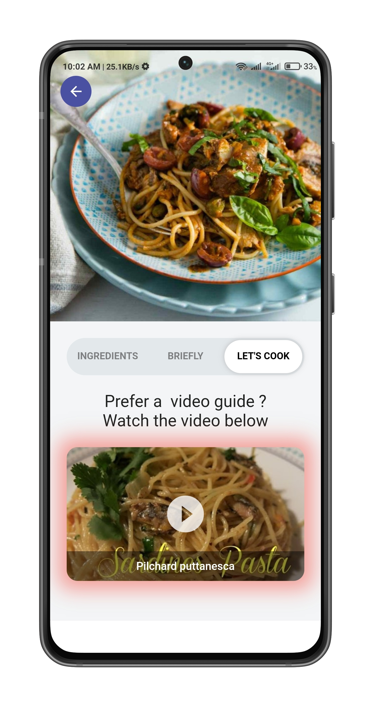

# 🍽️ Tasty

Tasty is a beautifully designed Recipes app that helps you explore, filter, and cook recipes from around the world. This app provides full details for each meal including ingredients, instructions, and YouTube video tutorials — all with a clean and responsive UI.

---

## 🚀 Features

- 🔍 **Search Recipes** by name.
- 📂 **Filter Recipes** by:
  - Category (e.g. Dessert, Seafood)
  - Area (Cuisine like Italian, Mexican...)
  - Ingredient (e.g. Chicken, Rice...)
- 📋 **Ingredients View** with full list and measures.
- 👨‍🍳 **Steps View** with brief instructions.
- 🎬 **Video Tutorial** embedded from YouTube.
- 💨 Smooth loading using placeholders and animations.

---

## 📸 Screenshots

### 🏠 Home Page
Explore featured meals and categories.

### 🎲 Random Recipe
Get inspired by a randomly selected recipe from the App.

### 🔍 Search Page
Type in your favorite meal and search instantly.

<table>
  <tr>
    <td align="center">
      
    </td>
    <td align="center">
      
    </td>
  </tr>
</table>

### 📖 Recipe Details
Full details view with ingredients, cooking steps, and video.

<table>
  <tr>
    <td align="center">
      
    </td>
    <td align="center">
      
    </td>
    <td align="center">
      
    </td>
  </tr>
</table>